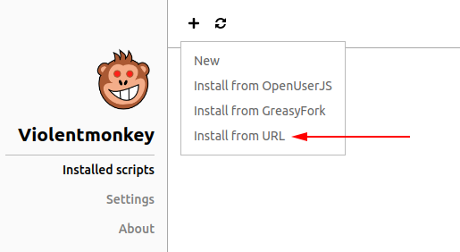

# odoo-qol
Some quality of life improvements for Odoo implemented as JS userscripts. Made for Violentmonkey, other addons not tested.

## Instructions

- Install Violentmonkey browser addon
- Go to dashboard > + > Install from URL
  
- Paste the raw link of desired file from GitHub
- Click "Confirm installation in the top-right
- Profit

## Scripts

### Project Kanban Middle Click and Ctrl+Click

Middle-clicking adn Ctrl+clicking task cards will open them in a new tab.

### Saner Dev Doc Index

Removes thumbnails from the Developer Docs index page (makes it easier to find things visually).
